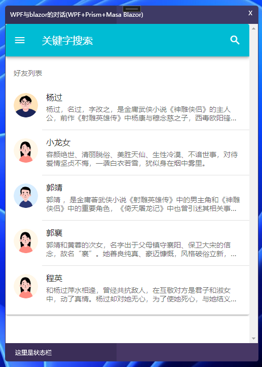
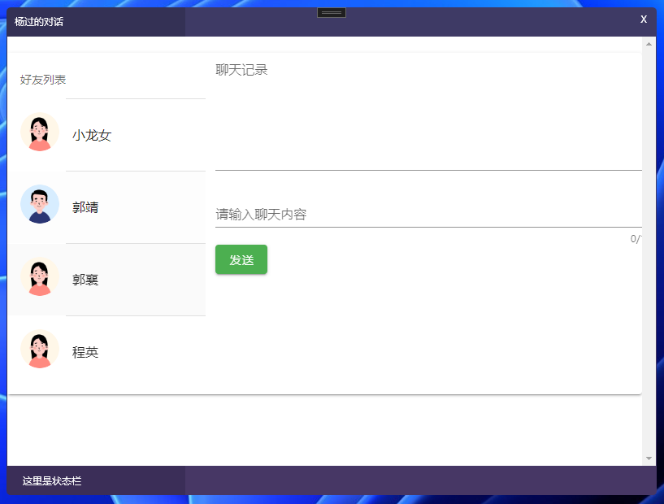
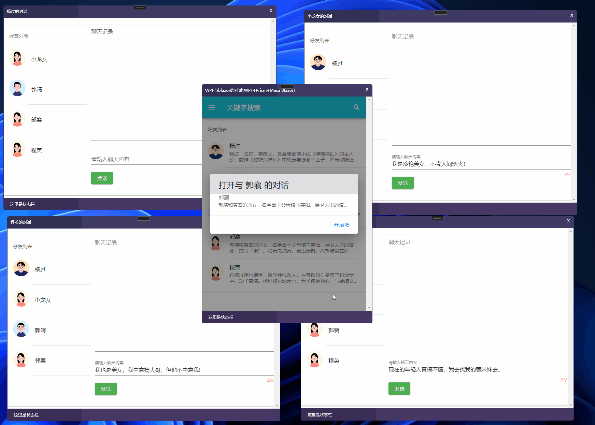

# WPFBlazorChat

WPF混合Blazor开发一个简易的对话程序

- [.NET 7](https://learn.microsoft.com/zh-cn/aspnet/core/blazor/hybrid/tutorials/wpf?view=aspnetcore-7.0)
- [Prism 8](https://github.com/PrismLibrary/Prism)
- [Masa Blazor](https://blazor.masastack.com/)

## 学习WPF Blazor

https://learn.microsoft.com/zh-cn/aspnet/core/blazor/hybrid/tutorials/wpf?view=aspnetcore-7.0

**用户列表窗口**

**聊天窗口**

**打开窗口**

**演示发送消息**

